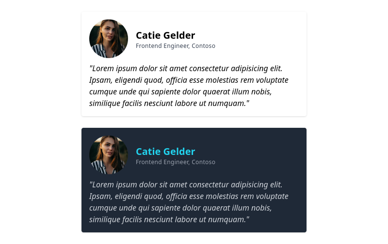

# Tailwind CSS

## ¿Qué es?

_Tailwind CSS_ es un framework que permite crear interfaces de usuario, con una gran diferencia sobre frameworks convencionales como _Bootstrap_, _Foundation_, _Bulma_... Es un framework utility-first, esto quiere decir que por lo general solo aplica una propiedad CSS por clase. La versatilidad de _Tailwind CSS_ se deja entrever cuando el diseño por defecto de frameworks como _Bootstrap_ se siente repetitivo o limitado para el diseño que tienes en mente, modificar _Bootstrap_ requiere conocimiento de preprocesadores CSS como SASS entre otras herramientas, mientras que en _Tailwind CSS_ es un simple archivo JavaScript lo que contiene toda la configuración del diseño para tu proyecto; paleta de colores, fuentes, medidas...

## Ventajas

- Mobile-first, centrado en el diseño para dispositivos móviles.
- Provee consistencia entre proyectos aplicando una serie de directrices, comúnmente denominado _Design System_.
- Completamente configurable, contiene clases especificas para diseños a medida, responsive, modo oscuro...
- Básicamente escribes CSS plano utilizando clases con nombres intuitivos, por lo que ganas un conocimiento más sólido del lenguaje base.
- Reduce los side effects, esto significa que al aplicar solo una propiedad CSS por clase su comportamiento es más intuitivo y natural, _Bootstrap_ aplica tantas propiedades CSS con una simple clase que puede ofrecer resultados inesperados en el propio elemento o en otros elementos cercanos.

## Desventajas

- No es la mejor opción para un prototipado rápido.
- Crear un setup optimizado es complejo y requiere conocimientos de otras herramientas web.
- Los elementos HTML pueden llegar a contener decenas de clases, especialmente cuando la aplicación se quiere adaptar a más dispositivos.

## Extrayendo componentes

Generalmente las clases que se repiten mucho suelen ser extraídas para crear componentes que se utilizarán en varias secciones de tu aplicación web, esto se consigue con la directiva `@apply`.

### Ejemplo: Card component

Utilizando las clases por defecto de _Tailwind CSS_:

```html
<article class="flex flex-col shadow rounded sm:p-4 dark:bg-gray-800">
  <header class="flex flex-col sm:flex-row">
    
    <div class="flex flex-col justify-center mt-2 ml-4 sm:mt-0">
      <h3 class="text-xl font-semibold dark:text-cyan-400">Catie Gelder</h3>
      <h4 class="text-xs tracking-wide text-gray-700 dark:text-gray-400">
        Frontend Engineer, Contoso
      </h4>
    </div>
  </header>

  <footer class="p-4 pt-2 sm:mt-2 sm:p-0">
    <p class="font-sm italic dark:text-gray-300">"Lorem ipsum..."</p>
  </footer>
</article>
```

Extrayendo las clases con `@apply` y organizándolas con `@layer`:

```css
@layer components {
  .card {
    @apply flex flex-col shadow rounded sm:p-4 dark:bg-gray-800;
  }

  .card-header {
    @apply flex flex-col sm:flex-row;
  }

  .card-profile {
    @apply rounded-t sm:w-20 sm:h-20 sm:rounded-full;
  }

  .card-container {
    @apply flex flex-col justify-center mt-2 ml-4 sm:mt-0;
  }

  .card-title {
    @apply text-xl font-semibold dark:text-cyan-400;
  }

  .card-subtitle {
    @apply text-xs tracking-wide text-gray-700 dark:text-gray-400;
  }

  .card-footer {
    @apply p-4 pt-2 sm:mt-2 sm:p-0;
  }

  .card-description {
    @apply font-sm italic dark:text-gray-300;
  }
}
```

Resultado final:

```html
<article class="card">
  <header class="card-header">
    
    <div class="card-container">
      <h3 class="card-title">Catie Gelder</h3>
      <h4 class="card-subtitle">Frontend Engineer, Contoso</h4>
    </div>
  </header>

  <footer class="card-footer">
    <p class="card-description">"Lorem ipsum..."</p>
  </footer>
</article>
```




Nota: Por defecto _Tailwind CSS_ utilizará el theme acorde al seleccionado en nuestro sistema operativo, el código que utilizaríamos en la aplicación sería el segundo componente, puesto que el primero no hace uso del prefijo `dark`.

## Conclusión

A grandes rasgos _Bootstrap_ y _Tailwind CSS_ no son tan diferentes, ambos facilitan el trabajo de escribir CSS de una forma más mantenible, elegir entre uno u otro dependerá de la complejidad del proyecto; cuanto más te alejes de la configuración por defecto de _Bootstrap_, mayor ventaja obtendrás utilizando un framework tan versátil como _Tailwind CSS_.

## Demo

- [Web Zenva](https://arlomba.github.io/altia-tailwindcss/)

## ¿Cómo empiezo a maquetar webs?

Normalmente defino la estructura que quiero que tenga la página y la descompongo en pequeñas piezas, colocando los contenedores (`header`, `nav`, `section`, `article`...) con contenido como dummy text (Lorem Ipsum) e imágenes (Placeholder, Lorem Picsum) para que vaya imitando el diseño que tengo en mente, los colores los ignoro hasta el final, simplemente utilizo diferentes tonos grises según la sección de la página. Una vez definida la estructura, comienzo a programar los elementos que creo que puede ser reutilizables (componentes), de ahí en adelante simplemente trato de juntar esos componentes con la estructura general como si de un rompecabezas se tratara.

Si necesito inspiración con el diseño, colores o la estructura de la página en general, me doy una vuelta por _dribbble_.

## Enlaces

- Tailwind CSS (https://tailwindcss.com/)
- Placeholder (https://placeholder.com/)
- Lorem Picsum (https://picsum.photos/)
- dribbble (https://dribbble.com/)
- unDraw (https://undraw.co/)
